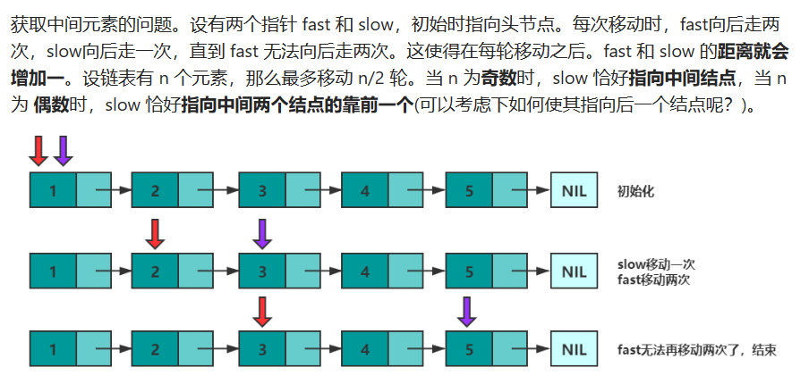

# 随机笔记  

主要记录算法学习中用到一些方法、思想、语法、函数等，突出一个想到啥记啥

- [数组](#数组)
- [递归](#递归)
- [回溯](#回溯)
- [双指针](#双指针)
- [分治](#分治)
- [动态规划](#动态规划)
- [贪心算法](#贪心算法)
- [字符串](#字符串)
- [链表](#链表)
- [排序](#排序)

----

一些方法和规则

[整数的一些规则](#整数的一些规则)
[模拟](#模拟和矩阵本质就是数组的处理)

----

## 数组

### 数组排序

----

```JAVA
//使用了Java中的Arrays.sort()方法来对一个数组进行排序
Arrays.sort(properties,(i,j)->i[0]!=j[0]?j[0]-i[0]:i[1]-j[1]);
//排序的方式是通过一个lambda表达式作为参数。
//lambda表达式(i, j) -> i[0] != j[0] ? j[0] - i[0] : i[1] - j[1]定义了一个比较器，用于比较数组中的元素。
//该比较器首先比较两个元素的第一个索引位置的值i[0]和j[0]，如果它们不相等，则按照降序进行排序，即j[0] - i[0]。
//如果它们相等，则比较两个元素的第二个索引位置的值i[1]和j[1]，并按照升序进行排序，即i[1] - j[1]。
```

注意Java中的`Arrays.sort()`方法，在定义降序排序时，对基本类型（`int float`）没有作用，需封装成Integer或者其他数组进行逆序排序。  
附一个int转integer的两种常用方法：

```JAVA
//for循环转换
private static void method1(int [] nums) {
    Integer[] integers = new Integer[nums.length];
    for (int i = 0; i < nums.length; i++) {
        integers[i]=nums [i];
    }
    System.out.println(Arrays.toString(integers));
}
//流式编程
private static void method2(int[] nums) {
    Integer[] integers=Arrays.stream(nums).boxed().toArray(Integer[]::new);
    System.out.println(Arrays.toString(integers));
}
//使用例
class Solution {
    public int deleteGreatestValue(int[][] grid) {
        Integer[][] newgrid=extracted(grid);
        for (Integer[] is : newgrid) {
            Arrays.sort(is,(a,b)->b-a);
        }
        int max=0 ;
        int ans=0;
        for (int i = 0; i < newgrid.length; i++){
            for(int j=0;j<newgrid[0].length;j++){
                max=Math.max(max, newgrid[j][i]);
            }
           ans+=max;
        }
        return ans;
    }
    private Integer[][] extracted(int[][] grid) {
        Integer[][] newgrid=new Integer[grid.length][grid[0].length];
        for (int i = 0; i < grid.length; i++){
            for(int j=0;j<grid[0].length;j++){
                newgrid[i][j]=grid[i][j];
            }
        }
        return newgrid;
    }
}
```

在一些排序比较的算法题中常用，先进行排序在找出自己需要的数据。

### 二维数组排序

对于一个二维数组`intervals = {{2,3},{2,9},{4,5},{3,7},{6,7},{8,9},{1,10}}`,想要针对每个元素中的第一个元素大小进行排序

主要有三种写法,o1和o2可以理解为二维数组中的任意两个一维子数组，其中o1[0]与o2[0]即为两个子数组各自第一个元素。返回值中o1[x] - o2[x] 表示升序排列，o2[x] - o1[x] 表示降序排列，x即为按照一维子数组的x索引元素进行排列。

1. Comparator常规

   ```java
   
   int[][] intervals = {{2,3},{2,9},{4,5},{3,7},{6,7},{8,9},{1,10}};
   Arrays.sort(intervals, new Comparator<int[]>() {
       @Override
       public int compare(int[] o1, int[] o2) {
           if(o1[0]==o2[0]){
               return o1[1] - o2[1];
           }
           return o1[0] - o2[0];
       }
   });
   ```

2. Lambda表达式

   ```java
   Arrays.sort(intervals, (o1, o2) -> {
       return o1[2] - o2[2];
   });
   ```

3. Comparator.comparingInt()方法

   ```java
   Arrays.sort(intervals, Comparator.comparingInt(o -> o[2]));
   ```

## 分治

本质是吧一个较大的问题进行细化，分解成为各个小问题进行解决。
**题目：50.Pow(x, n)**：实现 pow(x, n) ，即计算 x 的整数 n 次幂函数（即，$x^n$ ）。
这个问题中，直接将整数x自乘n次会浪费太多的时间，注意到$x^n=x^\frac{n}{2}\times x^\frac{n}{2}$,通过这样的方法把原问题化解。

这个解决的方法又叫**快速幂方法**，举一个例子:要求$x^{64}$，则：
$$
x\rightarrow x^2 \rightarrow x^4\rightarrow x^8 \rightarrow x^{16} \rightarrow x^{32} \rightarrow x^{64}
$$
只需要六次计算即可得到答案。同时可以用到递归的思想，求$x^{n}$可以先求$x^\frac{n}{2}$,但是当n为奇数时$x^{n}=x^\frac{n}{2} \times x^\frac{n}{2} \times x$通过递归判断的方法就可以实现。

示例代码：

```java
class Solution {
    public double myPow(double x, int n) {
        //递归重要的先设置递归出口
        if(n==0){
            return 1.0;
        }
        //分别判断进入递归过程
        else if(n%2==0){
            double ans=myPow(x, n/2);
            return ans*ans;
        }
        else{
            double ans=myPow(x, n/2);
            return ans*ans*x;
        }
    }
}
```

这版写法在算法过程没有太大问题，但是出现了逻辑上的漏洞，既是这样的写法没有考虑到负数幂的情况。重新考虑负数，将递归方法重写一个函数。

```java
class Solution {
    public double myPow(double x, int n) {
        if(n>=0){
            return powxn(x, n);
        }
        else{
            return 1.0/powxn(x, -n);
        }
    }
    public double powxn(double x, int n) {
        //递归重要的先设置递归出口
        if(n==0){ 
            return 1.0;
        }
        else if(n%2==0){
            double ans=powxn(x, n/2);
            return ans*ans;
        }
        else{
            double ans=powxn(x, n/2);
            return ans*ans*x;
        }
    }
}
```

## 递归

----

递归的思想：**函数在运行时调用自己**，这个函数就叫递归函数，调用的过程叫做递归。

- 递归函数必须要有**终止条件**，否则会出错；
- 递归函数先不断调用自身，直到遇到终止条件后进行回溯，最终返回答案。

能加深递归理解的一道题：**21.合并两个有序链表**：

> 将两个升序链表合并为一个新的 **升序** 链表并返回。新链表是通过拼接给定的两个链表的所有节点组成的。

此题在求解时不太容易想到递归的解法，但主动用递归的思想去思考这个题目，会发现递归其实很好适用此题。

两个链表头部值较小的一个节点与剩下元素的 `merge` 操作结果合并。
$$
{\left\{ \begin{array}{ll} list1[0] + merge(list1[1:], list2) & list1[0] < list2[0] \\ list2[0] + merge(list1, list2[1:]) & otherwise \end{array} \right.
}
$$
此题在递归的归之前不会实际修改链表，所以可以保证顺序不会错乱，也是此题适用递归的一个重大的好处

示例代码：

```java
class Solution {
    public ListNode mergeTwoLists(ListNode list1, ListNode list2) {
        //递归
        //定义边界条件，当有一个链表为空时，只需返回另一链表
        if (list1==null) {
            return list2;
        }
        if(list2==null){
            return list1;
        }
        if (list1.val>=list2.val) {
            //这里的合并递归需要注意链接的点
            //在递归的归之前不会实际修改链表，所以可以保证顺序不会错乱，也是此题适用递归的一个重大的好处
            list2.next=mergeTwoLists(list1, list2.next);
            return list2;
        }
        else{
            list1.next=mergeTwoLists(list1.next, list2);
            return list1;
        }
    }
}
```


## 回溯

----

回溯法 采用试错的思想，它尝试分步的去解决一个问题。在分步解决问题的过程中，当它通过尝试发现现有的分步答案不能得到有效的正确的解答的时候，它将取消上一步甚至是上几步的计算，再通过其它的可能的分步解答再次尝试寻找问题的答案。回溯法通常用最简单的递归方法来实现，在反复重复上述的步骤后可能出现两种情况：

找到一个可能存在的正确的答案；
在尝试了所有可能的分步方法后宣告该问题没有答案。

问题：**46.全排列**：

> 给定一个不含重复数字的数组 `nums` ，返回其 *所有可能的全排列* 。你可以 **按任意顺序** 返回答案。


示例代码：

```java
class Solution {
    public List<List<Integer>> permute(int[] nums) {
        int n = nums.length;
        List<List<Integer>> ans = new ArrayList<>();
        if (n == 0) {
            return ans;
        }
        boolean[] used=new boolean[n];
        List<Integer> pos=new ArrayList();
        dfc(nums, n, 0, used,pos, ans);
        return ans;
    }
    //递归划小排列，回溯完成全排
    void dfc(int[] nums,int n,int index,boolean[] used ,List<Integer> pos,List<List<Integer>> ans){
        int i;
        if(index==n){  //递归出口
            ans.add(new ArrayList<>(pos));  //执行拷贝，避免pos回溯后变为空列表
            return;
        }
        for(i=0;i<n;i++ ){  
            if (!used[i]) {  //当前位置元素未被使用
                pos.add(nums[i]);
                used[i]=true;
                dfc(nums, n, index+1, used, pos, ans);
                used[i]=false;    //递归后重置，为下次排列进行准备
                pos.remove(pos.size()-1);
            }
        }
    }
}


```


## 双指针

----

通常是设置快慢指针来处理一些有顺序的问题的思想，或者是找中位数等等。

（[在链表的应用](#链表)）



经典的双指针使用：**167.两数之和-ii-输入有序数组**

> 给你一个下标从 **1** 开始的整数数组 `numbers` ，该数组已按 **非递减顺序排列** ，请你从数组中找出满足相加之和等于目标数 `target` 的两个数。如果设这两个数分别是 `numbers[index1]` 和 `numbers[index2]` ，则 `1 <= index1 < index2 <= numbers.length` 。
>
> 以长度为 2 的整数数组 `[index1, index2]` 的形式返回这两个整数的下标 `index1` 和 `index2`。
>
> 你可以假设每个输入 **只对应唯一的答案** ，而且你 **不可以** 重复使用相同的元素。
>
> 你所设计的解决方案必须只使用常量级的额外空间。

这个问题很经典的可以使用双指针来解决：分别使用两个指针指向数组的开头和末尾。通过判断当前和与目标值的大小，选择移动左指针还是右指针，这样可以避免错过一些解。

示例代码：

```java
class Solution {
    public int[] twoSum(int[] numbers, int target) {
        int left=0,right=numbers.length-1;
        while(left<right){
            if(numbers[left]+numbers[right]==target){
                return new int[]{left+1,right+1};
            }
            else if(numbers[left]+numbers[right]>target){
                right--;
            }
            else{
                left++;
            }
        }
        return null;
    }
}
```

## 滑动窗口

----

题目：**209.长度最小的子数组**：

> 给定一个含有 `n` 个正整数的数组和一个正整数 `target` 。
>
> 找出该数组中满足其总和大于等于 `target` 的长度最小的 **连续子数组** `[numsl, numsl+1, ..., numsr-1, numsr]` ，并返回其长度**。**如果不存在符合条件的子数组，返回 `0` 。

暴力解此题的方法需要 $O(n^2)$的时间复杂度，使用滑动窗口的方法可以使时间复杂度降到线性。

用两个指针组成窗口遍历一次数组，就可以完成此题：

示例代码:(重要的是end指针和start指针的移动)

```java
class Solution {
    public int minSubArrayLen(int target, int[] nums) {
        //暴力解
        // int min=Integer.MAX_VALUE;
        // for (int i = 0; i < nums.length; i++) {
        //     int sum=0;
        //     int len=0;
        //     while(sum<target&&i+len<nums.length){
        //         sum+=nums[i+len];
        //         len++;
        //     }
        //     if(sum>=target){
        //         min=Math.min(min, len);
        //     }
        // }
        // return min==Integer.MAX_VALUE? 0 : min;
        //滑动窗口
        int start=0,end=0;
        int sum=0;  //sum用来记录窗口内的数组和
        int minLen=Integer.MAX_VALUE;  //minLen用来维护最小子数组长度
        while(end<nums.length){
            sum+=nums[end];
            while(sum>=target){
                minLen=Math.min(minLen, end-start+1);
                sum-=nums[start];
                start++;
            }
            end++;
        }
        return minLen==Integer.MAX_VALUE? 0: minLen;
    }
}
```

题目：**3.无重复字符的最长子串**：

> 给定一个字符串 `s` ，请你找出其中不含有重复字符的 **最长子串** 的长度。

此题用滑动窗口的思想求解也会非常便利。

示例代码：

```java
class Solution {
    public int lengthOfLongestSubstring(String s) {
        int start=0,end=0;
        int maxLen=0;
        //创建字典来记录出现过的字符和其第一次出现的位置
        Map<Character,Integer> sawChar=new HashMap<>();
        while(end<s.length()){
            Character ch=s.charAt(end);
            if(sawChar.containsKey(ch)){
                if(sawChar.get(ch)>=start){
                    start=sawChar.get(ch)+1;
                }
            }
            sawChar.put(ch, end);
            maxLen=Math.max(maxLen, end-start+1);
            end++;
        }
        return maxLen;
    }
}
```


## 动态规划

----

- 示例题目：最大子数组和

> 给你一个整数数组 $nums$ ，请你找出一个具有最大和的连续子数组（子数组最少包含一个元素），返回其最大和。  
子数组 是数组中的一个连续部分。

这是一个经典的使用动态规划解决的题目。动态规划的关键在于：

1. 理解题意，本题主要是子数组必须是连续的。
2. 定义子问题或者叫状态，本题中可以定义子问题为：以某个元素为末尾的子数组的最大和。

发现关键后，问题会被分解为解决子问题，从而从子问题之间的联系进行解题。

> 例：输入数组是 [-2,1,-3,4,-1,2,1,-5,4]
>> 列出子问题如下：
子问题 1：以 −2 结尾的连续子数组的最大和是多少；  
子问题 2：以 1 结尾的连续子数组的最大和是多少；  
子问题 3：以 −3 结尾的连续子数组的最大和是多少；  
子问题 4：以 4 结尾的连续子数组的最大和是多少；  
子问题 5：以 −1 结尾的连续子数组的最大和是多少；  
子问题 6：以 2 结尾的连续子数组的最大和是多少；  
子问题 7：以 1 结尾的连续子数组的最大和是多少；  
子问题 8：以 −5 结尾的连续子数组的最大和是多少；  
子问题 9：以 4 结尾的连续子数组的最大和是多少。  

如果编号为 i 的子问题的结果是负数或者 0 ，那么编号为 i + 1 的子问题就可以把编号为 i 的子问题的结果舍弃掉。

- 示例代码：(分别是优化了空间和不优化空间的方法)

```java
public class Solution {
    public int maxSubArray(int[] nums) {
        int len = nums.length;
        // dp[i] 表示：以 nums[i] 结尾的连续子数组的最大和
        int[] dp = new int[len];
        dp[0] = nums[0];

        for (int i = 1; i < len; i++) {
            if (dp[i - 1] > 0) {
                dp[i] = dp[i - 1] + nums[i];
            } else {
                dp[i] = nums[i];
            }
        }
        // 也可以在上面遍历的同时求出 res 的最大值，这里我们为了语义清晰分开写，大家可以自行选择
        int res = dp[0];
        for (int i = 1; i < len; i++) {
            res = Math.max(res, dp[i]);
        }
        return res;
    }
}
```

```java
public class Solution {
    public int maxSubArray(int[] nums) {
        int pre = 0;
        int res = nums[0];
        for (int num : nums) {
            pre = Math.max(pre + num, num);
            res = Math.max(res, pre);
        }
        return res;
    }
}
```

#### 动态规划常见类型之斐波那契

经典题目：爬楼梯
> 假设你正在爬楼梯。需要 n 阶你才能到达楼顶。
每次你可以爬 1 或 2 个台阶。你有多少种不同的方法可以爬到楼顶呢？  

用$f(x)$表示爬到$x$层的方案数，因为每一次只能爬1个或者2个台阶则$f(x)=f(x-1)+f(x-2)$。根据这种思想，就可以用一种跟斐波那契数列相同的思想来解决这个问题，可以简单的知道$f(1)=1$，既是走一层一定只有一种走法，同时从0层走到0层也只看做一种方案，既是特殊的$f(0)=0$。则可通过上个方程得到通过累加获得爬到$x$层的方案数。  
示例代码：因为$f(x)$只与$f(x-1)$和$f(x-2)$有关，这里用到了滑动窗口（滚动数组）的思想，优化了空间复杂度。

```java
class Solution {
    public int climbStairs(int n) {
        int x=1,y=1,ans=1;
        for (int i = 0; i < n-1; i++) {
            x=y;
            y=ans;
            ans=x+y;
        }
        return ans;
    }
}
```

**解题重点**：这里也是细化了每个状态，寻找定义一个状态与其他状态的关系，通过状态间的联系找到解题的关键。  
问题：斐波那契数列
> *斐波那契数列*可以用类似的解法：斐波那契数 （通常用 F(n) 表示）形成的序列称为 斐波那契数列 。该数列由 0 和 1 开始，后面的每一项数字都是前面两项数字的和。

相比爬楼梯问题只用注意一些边界即可，示例代码：

```java
class Solution {
    public int fib(int n) {
        int x=0,y=1,ans=0 ;
        for (int i = 0; i < n; i++) {
            x=y;
            y=ans;
            ans=x+y;
        }
        return ans;
    }
}
```

#### 进阶一点点的动态规划

题目：使用最小花费爬楼梯
> 给你一个整数数组 cost ，其中 cost[i] 是从楼梯第 i 个台阶向上爬需要支付的费用。一旦你支付此费用，即可选择向上爬一个或者两个台阶。
你可以选择从下标为 0 或下标为 1 的台阶开始爬楼梯。
请你计算并返回达到楼梯顶部的最低花费。

思路：同样细化状态，设$f(x)$为到达下标为$x$层时的最低花费，此时类似的有：
在这类问题中先明确边界问题：在这个问题中，当总层数为1或2时，没有意义，因为可以从下标为0或1的台阶开始，如果总层数为1或2，则最开始即可在楼梯顶部。
既是 $f(0)=f(1)$
$$
f(x)=min(f(x-1)+cost[x-1],f(x-2)+cost[x-2])
$$
这样就可以有类似斐波那契数列的解题方式，同样利用动态规划。示例代码：

```java
class Solution {
    public int minCostClimbingStairs(int[] cost) {
        int x=0,y=0,spend=0;
        //因为前两层没有意义可以从下标为2层开始。
        for (int i = 2 ; i <= cost.length; i++) {
            spend=Math.min(x+cost[i-2], y+cost[i-1]);
            x=y;
            y=spend;
        }
        return spend;
    }
}
```

**重点思想**：重要的是找到状态的更变方程，像是：$f(x)=min(f(x-1)+cost[x-1],f(x-2)+cost[x-2])$，找到边界的状态也是同样的重点。同时使用滑动窗口的思想优化空间使用。

#### 进一步理解动态规划

题目：打家劫舍
> 你是一个专业的小偷，计划偷窃沿街的房屋。每间房内都藏有一定的现金，影响你偷窃的唯一制约因素就是相邻的房屋装有相互连通的防盗系统，如果两间相邻的房屋在同一晚上被小偷闯入，系统会自动报警。
给定一个代表每个房屋存放金额的非负整数数组，计算你 不触动警报装置的情况下 ，一夜之内能够偷窃到的最高金额。

先考虑边界状态，只有一间时，直接抢；有两间时，选多的那家直接抢；三间以上时，考虑中间比 边上两家的和。在超过三间及三间以上的情况下，将抢你间房屋的问题转化为抢前n-2或者，前n-1间房屋的问题。每个子问题都这样前推，可以把子问题定义为抢劫$k(k<n)$ 间房屋的问题设$f(k)$为偷盗前$k$个房间的最大值  
简单的将问题前推，要求$f(k)$，有两种情况，1 前一个房间(k-1)被偷盗，2 前一个房间（k-1）没有被偷盗。可以得到状态递推公式：
$$
f(k)=max(f(k-1),f(k-2)+nums[k-1])
$$
到这里可以开始尝试写代码：

```java
class Solution {
    public int rob(int[] nums) {
        if (nums.length==1){
            return nums[0];
        }
        int x=nums[0],y=Math.max(nums[0], nums[1]),ans=Math.max(x, y);
        for (int i = 1; i < nums.length-1; i++) {
            ans=Math.max(x+nums[i+1], y);
            x=y;
            y=ans;
        }
        return ans;
    }
}
```

类似题目：**740.删除获得点数**
> 给你一个整数数组 nums ，你可以对它进行一些操作。
每次操作中，选择任意一个 nums[i] ，删除它并获得 nums[i] 的点数。之后，你必须删除 所有 等于 nums[i] - 1 和 nums[i] + 1 的元素。
开始你拥有 0 个点数。返回你能通过这些操作获得的最大点数。

在解决时使用了一个新的数组$som[maxVal]$，下标是原数组中的元素，而值可以是该元素的数量（或是元素和），这里也是使用动态规划解决本题的关键思想所在，一个值可以存在多个，通过计算每个值出现多次的和，将$nums[i]-1$和$nums[i] + 1$的问题转化为新数组$som[nums[i]-1]$和$som[nums[i]+1]$这样的问题。此后的问题基本与问题：*打家劫舍*相同。
同样的使用了滑动窗口的思想来优化内存的使用。
代码示例：

```java
class Solution {
    public int deleteAndEarn(int[] nums) {
        int maxVal=0;
        for (int i = 0; i < nums.length; i++) {
            maxVal=Math.max(maxVal, nums[i]);
        }
        int[] soms=new int[maxVal+1];
        for (int val : nums) {
            soms[val]+=val;
        }
        if(soms.length==1){
            return soms[0];
        }
        int x=soms[0],y=Math.max(soms[0], soms[1]);
        int ans=Math.max(x, y);
        for (int i = 2; i < soms.length; i++) {
            ans=Math.max(x+soms[i], y);
            x=y;
            y=ans;
        }
        return ans;
    }
}
```

### 动态规划应用

题目：**55.跳跃游戏:**

> 给你一个非负整数数组 `nums` ，你最初位于数组的 **第一个下标** 。数组中的每个元素代表你在该位置可以跳跃的最大长度。判断你是否能够到达最后一个下标，如果可以，返回 `true` ；否则，返回 `false` 。

*我的解题思路：*用动态规划的思想，在遍历数组的同时维护一个最大值，用以表示时刻能够到达的最远下标，遍历整个数组后，比较这个最大值与数组长度下标即可。

示例代码：

```Java
class Solution {
    public boolean canJump(int[] nums) {
        int max =0;
        for (int i = 0; i < nums.length; i++) {
            if(max>=i){
                max=Math.max(max, i+nums[i]);
            }
        }
        if(max>=nums.length-1){
            return true;
        }
        else{
            return false;
        }
    }
}
```

## 贪心算法

----

贪心很多时候是寻找问题的最优解法，设想模拟最优解法。通过局部最优解法得到全局的最优解，贪心算法往往可以确定一种针对问题的贪心策略。

典型问题：**45.跳跃游戏Ⅱ**：

> 给定一个长度为 `n` 的 **0 索引**整数数组 `nums`。初始位置为 `nums[0]`。
>
> 每个元素 `nums[i]` 表示从索引 `i` 向前跳转的最大长度。换句话说，如果你在 `nums[i]` 处，你可以跳转到任意 `nums[i + j]` 处:
>
> - `0 <= j <= nums[i]` 
> - `i + j < n`
>
> 返回到达 `nums[n - 1]` 的最小跳跃次数。生成的测试用例可以到达 `nums[n - 1]`。

我的解决方法是一种时刻向最优情况靠拢的办法，跟**55.跳跃游戏**相似，维护一个能到达地址的最大值。

示例代码：（对于解决这个问题而言不够完善，但能通过测试用例）

```Java
class Solution {
    public int jump(int[] nums) {
        int k=0;
        int i=0,maxindex=nums.length-1;
        int mCur=nums[0];//维护一个最大值，表示当前坐标能走最远的下标
        if(maxindex==0){
            return 0;
        }
        if(mCur>=maxindex){
            return 1;
        }
        while(i<maxindex){
            int dis=i+nums[i];
            for (int j = i; j <= dis&&j<=maxindex; j++) {
                if(j+nums[j]>mCur){
                    //每次移动前寻找最远
                    mCur=j+nums[j];
                    i=j;
                }
            }
            k++;
            if(i<maxindex&&mCur>=maxindex){
                return k+1;
            }
        }
        return k;
    }
}
```


----

### 暂未解决的问题

**1275.井字棋的获胜者**

> 给你一个数组 moves，其中每个元素是大小为 2 的另一个数组（元素分别对应网格的行和列），它按照 A 和 B 的行动顺序（先 A 后 B）记录了两人各自的棋子位置。
>如果游戏存在获胜者（A 或 B），就返回该游戏的获胜者；如果游戏以平局结束，则返回 "Draw"；如果仍会有行动（游戏未结束），则返回 "Pending"。
你可以假设 moves 都 有效（遵循井字棋规则），网格最初是空的，A 将先行动。  

这里的解决还需要具体的分析

> 2208.将数组和减半的最少操作次数
>
> > 需要贪心与优先队列同时使用，目前只对贪心算法部分进行了了解。

```java
class Solution {
    public int halveArray(int[] nums) {
        int ans;
        int sum=0;
        for (int i : nums) {
            sum+=i;
        }
        sum/=2;
        Arrays.sort(nums,(x,y)->y-x);
        int i=0;
        while(sum!=0){
            if(nums[i]/2<=sum){
                sum-=nums[0/2];
                nums[0]/=2;
                Arrays.sort(nums,(x,y)->y-x);
                ans++;
            }
            else{
                i++;
            }
        }
    }
}
```

## 链表

题目：环形链表
> 给你一个链表的头节点 head ，判断链表中是否有环。
如果链表中有某个节点，可以通过连续跟踪 next 指针再次到达，则链表中存在环。 为了表示给定链表中的环，评测系统内部使用整数 pos 来表示链表尾连接到链表中的位置（索引从 0 开始）。注意：pos 不作为参数进行传递 。仅仅是为了标识链表的实际情况。
如果链表中存在环 ，则返回 true 。 否则，返回 false 。

**判断思路**；

1.**哈希表**：经过每一个节点都判断是否已经经过，没经历过就加入哈希表。这种方法较好想到，也符合第一直觉。

代码：

```java
public class Solution {
    public boolean hasCycle(ListNode head) {
        Set<ListNode> mysSet=new HashSet<ListNode>();
        while(head!=null){
            if(!mysSet.add(head)){
                return true;
            }
            head=head.next;
        }
        return false;
    }
}
```

2.**快慢指针的方法**：（用于获取倒数第K个元素，中间位置的元素，判断链表是否存在环）本质是对双指针方法的灵活应用。
解释其一：


在本题的应用： 当一个链表有环时，快慢指针都会陷入环中进行无限次移动，然后变成了追及问题。想象一下在操场跑步的场景，只要一直跑下去，快的总会追上慢的。当两个指针都进入环后，每轮移动使得慢指针到快指针的距离增加一，同时快指针到慢指针的距离也减少一，只要一直移动下去，快指针总会追上慢指针。

代码：

```java
public class Solution {
    public boolean hasCycle(ListNode head) {
        
    }
}
```

### 用来理解递归和迭代的反转链表

题目：**206.反转链表**：

> 给你单链表的头节点 `head` ，请你反转链表，并返回反转后的链表。

首先容易理解和想到的：**迭代遍历修改**只需要两个变量暂存当前节点和前一个节点

```java
class Solution {
    public ListNode reverseList(ListNode head) {
        //非递归的写法：迭代遍历更改，使用两个变量暂存当前节点和前一个节点便于修改链接
        ListNode pre=null,curr=head;
        while(curr!=null){
            //迭代更改即可
            ListNode next=curr.next;
            curr.next=pre;
            pre=curr;
            curr=next;
        }
        return pre;
    }
}
```

**递归的写法** ：理想递归下，但是再次丢失了头节点的位置，重写为两参数的递归：

实例代码：

```java
class Solution {
    public ListNode reverseList(ListNode head) {
		return rev_ListNode(head,null);
    }
    public ListNode rev_ListNode(ListNode head,ListNode pre){
        //注意需要返回反转后的头节点，所以这里的返回始终都是最后找到了
        if(head==null){
            return pre;
        }
        else{
            //这里通过递归来修改链表的指向
            ListNode ans= rev_ListNode(head.next, head);
            head.next=pre;
            return ans;
        }
    }
}
```


## 字符串

----

### 字符串操作之子字符串

经典题目：*作为子字符串出现在单词中的字符串数目*:
> 给你一个字符串数组 patterns 和一个字符串 word ，统计 patterns 中有多少个字符串是 word 的子字符串。返回字符串数目。  
子字符串 是字符串中的一个连续字符序列。

JAVA中的方法：利用String的contains方法查询是否包含

```java
    int res = 0;
    for(int i = 0; i < patterns.length; i++) {
        if (word.contains(patterns[i])) {
             res++;
        }
    }
    return res;
```

入门题目：*找出字符串中第一个匹配项的下标*
> 给你两个字符串 haystack 和 needle ，请你在 haystack 字符串中找出 needle 字符串的第一个匹配项的下标（下标从 0 开始）。如果 needle 不是 haystack 的一部分，则返回-1

暴力解法：遍历匹配，从每个字符开始的字串与匹配串暴力匹配。

```java
class Solution {
    public int strStr(String haystack, String needle) {
        int n=haystack.length(),m=needle.length();
        char[] s=haystack.toCharArray(),p=needle.toCharArray();
        for(int i=0;i<=n-m;i++){
            int b=0;
            int t=i;
            while(s[t]==p[b]){
                t++;
                b++;
                if(b==m){
                    return i;
                }
            }
        }
        return -1;
    }
}
```
要优化的话就涉及一种重要算法：KMP算法
**KMP算法**:Knuth-Morris-Pratt 算法，简称 KMP 算法，由 Donald Knuth、James H. Morris 和 Vaughan Pratt 三人于 1977 年联合发表。  
其核心为**前缀函数**：  
对于长度为$m$的字符串$s$，其前缀函数$π(i)(0≤i<m)$表示 $s$ 的子串 $s[0:i]$ 的最长的相等的真前缀与真后缀的长度。特别地，如果不存在符合条件的前后缀，那么 $π(i)=0$ 。其中真前缀与真后缀的定义为不等于自身的的前缀与后缀。  
举个例子说明:字符串 $aabaaab$ 的前缀函数值依次为 0,1,0,1,2,2,3。

- π(0)=0，因为 $a$ 没有真前缀和真后缀，根据规定为 0（可以发现对于任意字符串 π(0)=0 必定成立）；
  - π(1)=1，因为$ aa $最长的一对相等的真前后缀为 $a$，长度为 1；π(2)=0，因为$ aab $没有对应真前缀和真后缀，根据规定为 0；

- π(3)=1，因为 $aaba $最长的一对相等的真前后缀为 $a$，长度为 1；
- π(4)=2，因为 $aabaa$ 最长的一对相等的真前后缀为 $aa$，长度为 2；
- π(5)=2，因为$ aabaaa $最长的一对相等的真前后缀为 $aa$，长度为 2；
- π(6)=3，因为$ aabaaab $最长的一对相等的真前后缀为 $aab$，长度为 3。
  **如何求解前缀函数**:长度为 $m$ 的字符串 $s$ 的所有前缀函数的求解算法的总时间复杂度是严格 $O(m)$ 的，且该求解算法是增量算法，即我们可以一边读入字符串，一边求解当前读入位的前缀函数。**这里算法的求解较为复杂，建议需要时在网上找到解析**

### 字符串操作之合并

经典题目：*交替合并字符串*
> 给你两个字符串 word1 和 word2 。请你从 word1 开始，通过交替添加字母来合并字符串。如果一个字符串比另一个字符串长，就将多出来的字母追加到合并后字符串的末尾。

使用StringBuilder中的方法append：

```java
class Solution {
    public String mergeAlternately(String word1, String word2) {
        StringBuilder ans=new StringBuilder();
        for (int i = 0,j=0; i < word1.length()|| j < word2.length(); i++,j++) {
            if(i<word1.length())
                ans.append(word1.charAt(i));
            if (j<word2.length())
                ans.append(word2.charAt(j));
        }
        return ans.toString();
    }
}
```

### 字符串操作之大小写转换API

```java
s.toLowerCase();//转化为小写
s.toUppercase();//转化为大写
```

### 字符判断是否是字母或数字的API

```java
Java.lang.Character.isLetterOrDigit();
//如果字符是字母或数字，此方法返回 true，否则返回 false。
```


### 很有意思的一个字符串题目

*找不同*：
> 给定两个字符串 s 和 t ，它们只包含小写字母。
字符串 t 由字符串 s 随机重排，然后在随机位置添加一个字母。
请找出在 t 中被添加的字母。

1.最快想到的其实是计数，对字符串中出现的字母进行计数，两次计数相减就可以的得到计数结果  
代码：

```java
class Solution {
    public char findTheDifference(String s, String t) {
        int[] aph=new int[26];
        for (int i = 0; i < s.length(); i++) {
            char ch=s.charAt(i);
            aph[ch-'a']++;
        }
        for (int i = 0; i < t.length(); i++) {
            char ch=t.charAt(i);
            aph[ch-'a']--;
            if(aph[ch-'a']<0){
                return ch;
            }
        }
        return ' ';
    }
}
```

2.求和的方式：把字符串的每个字符加起来，两次结果的差就是多出来的字母。  
代码：

```java
class Solution {
    public char findTheDifference(String s, String t) {
        int ans=0;
        for (int i = 0; i < s.length(); i++) {
            char ch=s.charAt(i);
           ans+=ch;
        }
        int anss=0;
        for (int i = 0; i < t.length(); i++) {
            char ch=t.charAt(i);
            anss+=ch;
        }
        return (char)(anss-ans);
    }
}
```

3.将两个字符串连接在一起，此时多的哪一个字母只出现一次，问题转化为找出字符串中的奇数字母，运用位运算（计算机术语，包括了移位、位与、或、异或、非。）

```java
// 1、左移( << )        
// 0000 0000 0000 0000 0000 0000 0000 0101 然后左移2位后，低位补0：
// 0000 0000 0000 0000 0000 0000 0001 0100 换算成10进制为20
System.out.println(5 << 2);
// 运行结果是20
// 2、右移( >> ) 高位补符号位
// 0000 0000 0000 0000 0000 0000 0000 0101 然后右移2位，高位补0：
// 0000 0000 0000 0000 0000 0000 0000 0001
System.out.println(5 >> 2);
// 运行结果是1
// 3、无符号右移( >>> ) 高位补0
// 例如 -5换算成二进制后为：0101 取反加1为1011
// 1111 1111 1111 1111 1111 1111 1111 1011
// 我们分别对5进行右移3位、 -5进行右移3位和无符号右移3位：
System.out.println(5 >> 3);
// 结果是0        
System.out.println(-5 >> 3);
// 结果是-1
System.out.println(-5 >>> 3);
// 结果是536870911
// 4、位与( & )
// 位与：第一个操作数的的第n位与第二个操作数的第n位如果都是1，那么结果的第n为也为1，否则为0System.out.println(5 & 3);
// 结果为1        
System.out.println(4 & 1);
// 结果为0
// 5、位或( | )
// 第一个操作数的的第n位与第二个操作数的第n位只要有一个是1，那么结果的第n为也为1，否则为0System.out.println(5 | 3);
// 结果为7
// 6、位异或( ^ )
// 第一个操作数的的第n位与第二个操作数的第n位相反，那么结果的第n为也为1，否则为0
System.out.println(5 ^ 3);
//结果为6
// 7、位非( ~ )
// 操作数的第n位为1，那么结果的第n位为0，反之。
System.out.println(~5);
// 结果为-6
```

代码：(用异或操作，相同为0 ，不同为1)

```java
class Solution {
    public char findTheDifference(String s, String t) {
        int ans=0;
        for (int i = 0; i < s.length(); i++) {
            ans^=s.charAt(i);
        }
        for (int i = 0; i < t.length(); i++) {
            ans^=t.charAt(i);
        }
        return (char)ans;
    }
}
```

## 整数的一些规则

### 整数相除的取整

Java中两个整数相除，如果不能整除，默认是向下取整的。例如11除3会向下取整得到3。
需要向上取整时

```java
(x + y - 1) / y
```

可以向上取整。通过加y-1来让不能整除的数向上取整，利用数的原理。但是这种方法显然只在正整数情况下适用。在需要考虑负数或零的情况下ceil的方法更为适用

```java
(int)Math.ceil((double)x/y)//转化为double再通过Math.ceil()函数向上取整。
```

## 排序

----

**快速排序**：重点思想其实是 “哨兵划分”，其目标是：选择数组中的某个元素作为“基准数”，将所有小于基准数的元素移到其左侧，而大于基准数的元素移到其右侧

我的实现：

```java
public class mySort {
    //哨兵划分：即通过选择基准数划分数组的操作
    public int sentinal(int[] nums,int lefti,int righti){
        int i=lefti,j=righti;
        //以最左边的数为基准数
        while(i<j){
            while(i<j && nums[j]>=nums[lefti])j--;//右边找到比基准数小的数
            /*这里一定要求右指针先动，否则答案会错误  
            避免出现多次将基准数换回去的情况 */
            while(i<j && nums[i]<=nums[lefti])i++;//左边找到比基准数大的数
            swap(nums, i, j);//交换两数
        }
        swap(nums, i, lefti);//将基准数交换到中间
        return i;//返回基准数交换到的位置 以方便后续继续划分
    }
    //交换数组中两数的函数
    public void swap(int[] nums,int i,int j ){
        int temp=nums[i];
        nums[i]=nums[j];
        nums[j]=temp;
    }
    public void quick_sort(int[] nums,int lefti,int righti){
        //设置递归的出口为子数组的长度为1时
        if(lefti>=righti){
            return;
        }
        int midbase=sentinal(nums, lefti, righti);//划分子数组
        quick_sort(nums, lefti, midbase-1);//递归左子数组
        quick_sort(nums, midbase+1, righti);//递归右子数组
    }
    //重写带参
    public void quick_sort(int[] nums){
        quick_sort(nums, 0, nums.length-1);
    }
     //输出数组的方法
    public void soutNums(int[] nums){
        for (int num : nums) {
            System.out.print(num+"  ");
        }
        System.out.print("\n"); 
    }
    public static void main(String[] args) {
        int[] unsorted=new int[]{-8,9,-7,6,-6,5,-4,9,-6,3,-2,2,-1,5};
        mySort mysort=new mySort();
        System.out.print("Unsorted : ");
        mysort.soutNums(unsorted);
        mysort.quick_sort(unsorted);
        System.out.print("Sorted : ");
        mysort.soutNums(unsorted);
    }
}
```

这里**哨兵划分中“从右往左查找”与“从左往右查找”的执行顺序**是不可以进行交换的：假设我们先“从左往右查找”，那么如果找不到比基准数更小的元素，**则会在 `i == j` 时跳出循环，此时可能 `nums[j] == nums[i] > nums[left]`**。也就是说，此时最后一步交换操作会把一个比基准数更大的元素交换至数组最左端，导致哨兵划分失败。

## 数学

----

**题目**：*1523.在区间范围内统计奇数数目*

>给你两个非负整数 low 和 high 。请你返回 low 和 high 之间（包括二者）奇数的数目

给你两个非负整数 low 和 high 。请你返回 low 和 high 之间（包括二者）奇数的数目
用到前缀和的思想解决这个问题，定义 $pre(x)$ 为区间 $[0,x]$ 中奇数的个数
则$pre(x)=[(x+1)/2]$，在Java中使用了位运算来进行除2取整的运算
示例代码：

```java
class Solution {
    public int countOdds(int low, int high) {
        return pore(high)-pore(low-1);
    }
    public int pore(int x){
        //位运算右移一位以达到除以2取整的作用
        return (x+1)>>1;
    }
}
```

## 模拟和矩阵（本质就是数组的处理）

### 模拟--根据描述进行推演实现

题目：*657. 机器人能否返回原点*：
> 在二维平面上，有一个机器人从原点 (0, 0) 开始。给出它的移动顺序，判断这个机器人在完成移动后是否在 (0, 0) 处结束。
移动顺序由字符串 moves 表示。字符 move[i] 表示其第 i 次移动。机器人的有效动作有 R（右），L（左），U（上）和 D（下）。
如果机器人在完成所有动作后返回原点，则返回 true。否则，返回 false。
注意：机器人“面朝”的方向无关紧要。 “R” 将始终使机器人向右移动一次，“L” 将始终向左移动等。此外，假设每次移动机器人的移动幅度相同。

题目描述中的启示点时机器人的面朝方向无关紧要。
解决的方法也很直接，通过判断语句循环指令模拟机器人运动即可。
示例代码：

```java
class Solution {
    public boolean judgeCircle(String moves) {
        int[] xy={0,0};
        for (int i = 0; i < moves.length(); i++) {
            switch (moves.charAt(i)) {
                case 'R':
                    xy[0]++;
                    break;
                case 'L':
                    xy[0]--;
                    break;
                case 'U':
                    xy[1]++;
                    break;
                case 'D':
                    xy[1]--;
                    break;
            }
        }
        boolean ans=false;
        if (xy[0]==0&&xy[1]==0) {
            ans=true;
        }
        return ans;
    }
}
```

### 矩阵的一些问题

比较有趣的一个题目：*54. 螺旋矩阵*
> 给你一个 m 行 n 列的矩阵 matrix ，请按照 顺时针螺旋顺序 ，返回矩阵中的所有元素。

此题的解决重点其实是如何理解，螺旋的顺时针，直接进行路线的模拟处理最容易想到，然后更新处理到的位置即可。
示例代码：

```java
class Solution {
    public List<Integer> spiralOrder(int[][] matrix) {
        int m=matrix.length,n=matrix[0].length;
        List<Integer> ans=new ArrayList<Integer>();
        //模拟螺旋遍历时的四个方向
        int[][] dir={{0,1},{1,0},{0,-1},{-1,0}};
        int ndir=0;
        int a=0,b=-1;
        while(m!=0&&n!=0){
            if(ndir%2==0){
                for (int i = 0; i < n; i++) {
                    a+=dir[ndir][0];
                    b+=dir[ndir][1];
                    ans.add(matrix[a][b]);
                }
                m--;
             }
            else{
                for (int i = 0; i < m; i++) {
                    a+=dir[ndir][0];
                    b+=dir[ndir][1];
                    ans.add(matrix[a][b]);
                }
                n--;
             }
            ndir=(ndir+1)%4;
        }
        return ans;
    }
}
```

## 位运算

（计算机术语，包括了移位、位与、或、异或、非。）
二进制右移1位可以起到除以2取整的作用：
`x + 1 >> 1` 表示 $(x+1)/2$

```java
// 1、左移( << )        
// 0000 0000 0000 0000 0000 0000 0000 0101 然后左移2位后，低位补0：
// 0000 0000 0000 0000 0000 0000 0001 0100 换算成10进制为20
System.out.println(5 << 2);
// 运行结果是20
// 2、右移( >> ) 高位补符号位
// 0000 0000 0000 0000 0000 0000 0000 0101 然后右移2位，高位补0：
// 0000 0000 0000 0000 0000 0000 0000 0001
System.out.println(5 >> 2);
// 运行结果是1
// 3、无符号右移( >>> ) 高位补0
// 例如 -5换算成二进制后为：0101 取反加1为1011
// 1111 1111 1111 1111 1111 1111 1111 1011
// 我们分别对5进行右移3位、 -5进行右移3位和无符号右移3位：
System.out.println(5 >> 3);
// 结果是0        
System.out.println(-5 >> 3);
// 结果是-1
System.out.println(-5 >>> 3);
// 结果是536870911
// 4、位与( & )
// 位与：第一个操作数的的第n位与第二个操作数的第n位如果都是1，那么结果的第n为也为1，否则为0System.out.println(5 & 3);
// 结果为1        
System.out.println(4 & 1);
// 结果为0
// 5、位或( | )
// 第一个操作数的的第n位与第二个操作数的第n位只要有一个是1，那么结果的第n为也为1，否则为0System.out.println(5 | 3);
// 结果为7
// 6、位异或( ^ )
// 第一个操作数的的第n位与第二个操作数的第n位相反，那么结果的第n为也为1，否则为0
System.out.println(5 ^ 3);
//结果为6
// 7、位非( ~ )
// 操作数的第n位为1，那么结果的第n位为0，反之。
System.out.println(~5);
// 结果为-6
```

### Map的遍历

**1. 使用for-each循环遍历Map集合**
使用`for-each`循环遍历Map集合是一种简单而常用的方法。它可以帮助我们快速遍历`Map`中的所有键值对。在使用for-each循环遍历Map集合时，需要使用`entrySet()`方法获取到`Map`中的键值对集合，并在循环体中使用`entry.getKey()`和`entry.getValue()`方法获取到当前循环的键和值。下面是一个示例代码：

```java
Map map = new HashMap<>();
map.put("apple", 1);
map.put("banana", 2);
map.put("orange", 3);

for (Map.Entry entry : map.entrySet()) {
 String key = entry.getKey();
 Integer value = entry.getValue();
 System.out.println(key + " = " + value);
}
```

**2. 使用迭代器遍历Map集合**

使用迭代器遍历`Map`集合也是一种常用的方法。它与使用`for-each`循环遍历`Map`集合的方式类似，但是更加灵活，可以在遍历过程中进行删除、修改等操作。在使用迭代器遍历Map集合时，需要使用`entrySet()`方法获取到Map中的键值对集合，并在每次循环中使用`iterator.next()`方法获取到当前的键值对，再使用`entry.getKey()`和`entry.getValue()`方法获取到当前键值对的键和值。下面是一个示例代码：

```java
Map map = new HashMap<>();
map.put("apple", 1);
map.put("banana", 2);
map.put("orange", 3);

Iterator> iterator = map.entrySet().iterator();
while (iterator.hasNext()) {
    Map.Entry entry = iterator.next();
    String key = entry.getKey();
    Integer value = entry.getValue();
    System.out.println(key + " = " + value);
}
```

3**. 使用Lambda表达式遍历Map集合**

Java 8引入了Lambda表达式，可以使用Lambda表达式遍历`Map`集合。它可以帮助我们更加简洁地遍历`Map`集合，并且可以结合Stream API进行操作。在使用Lambda表达式遍历Map集合时，需要使用`forEach()`方法，并在Lambda表达式中使用`(key, value) ->` 表达式的方式获取到当前的键和值。下面是一个示例代码：

```java
Map map = new HashMap<>();
map.put("apple", 1);
map.put("banana", 2);
map.put("orange", 3);

map.forEach((key, value) -> System.out.println(key + " = " + value));
```

**4. 使用Stream API遍历Map集合**

Java 8还引入了Stream API，可以使用Stream API遍历Map集合。它可以帮助我们更加简洁地对`Map`中的键值对进行过滤、映射等操作。在使用Stream API遍历Map集合时，需要使用`entrySet()`方法获取到`Map`中的键值对集合，并使用`.stream()`方法转换为Stream对象，最后使用`forEach()`方法遍历集合，输出到控制台。下面是一个示例代码：

```java
Map map = new HashMap<>();
map.put("apple", 1);
map.put("banana", 2);
map.put("orange", 3);

map.entrySet().stream().forEach(entry -> System.out.println(entry.getKey() + " = " + entry.getValue()));
```
